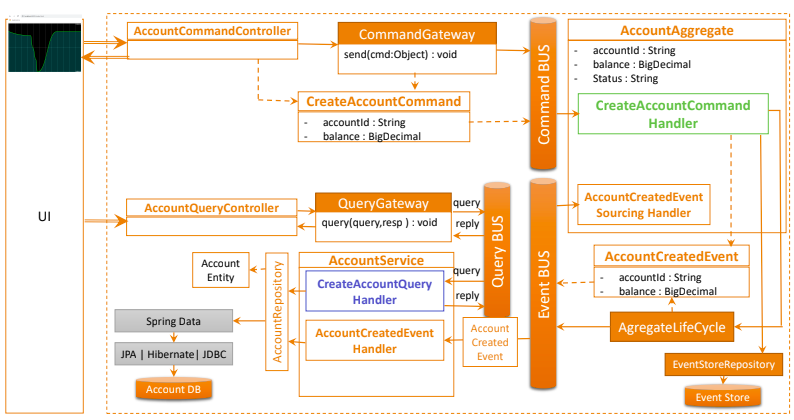
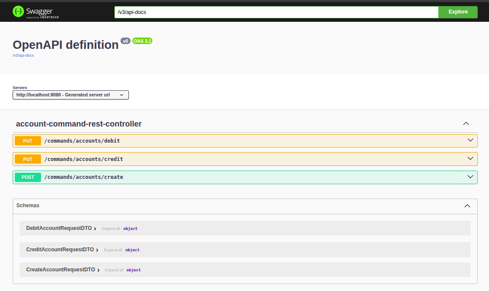
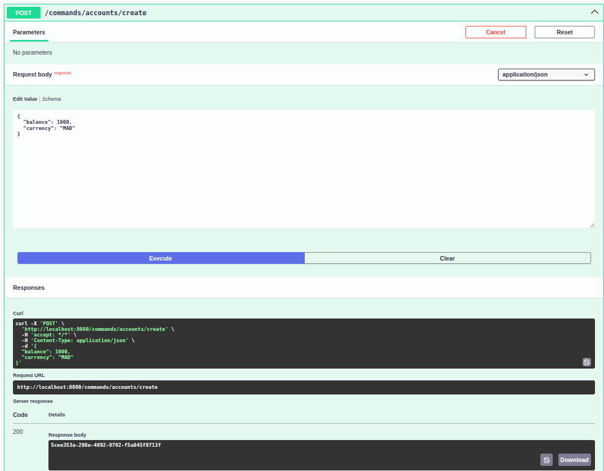
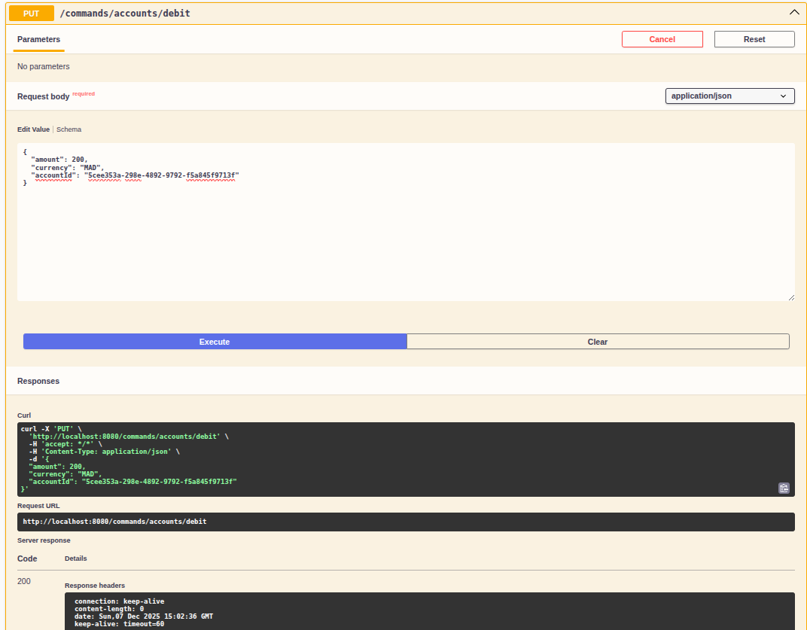
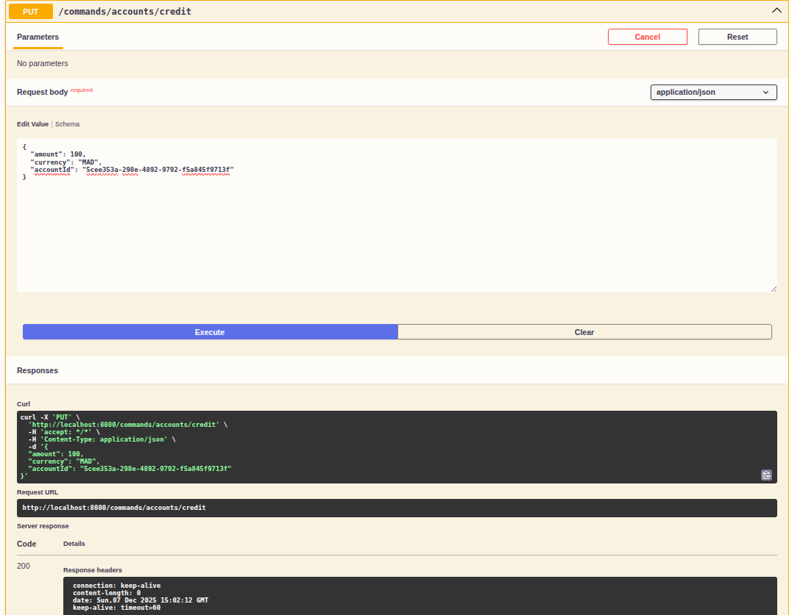
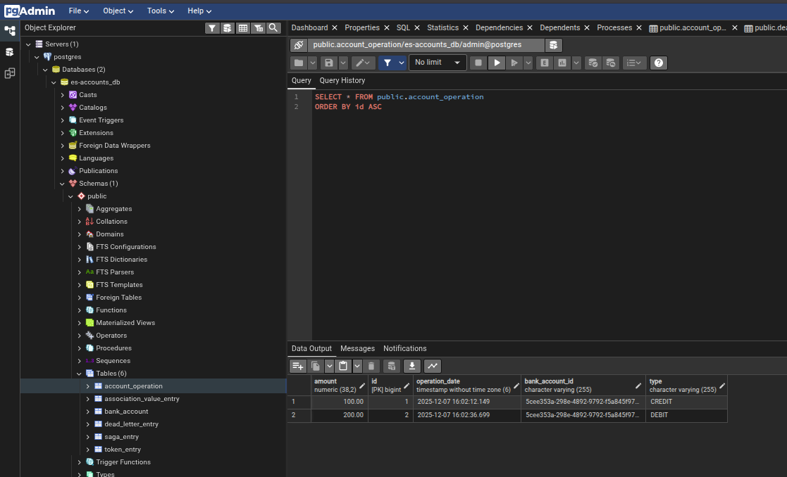
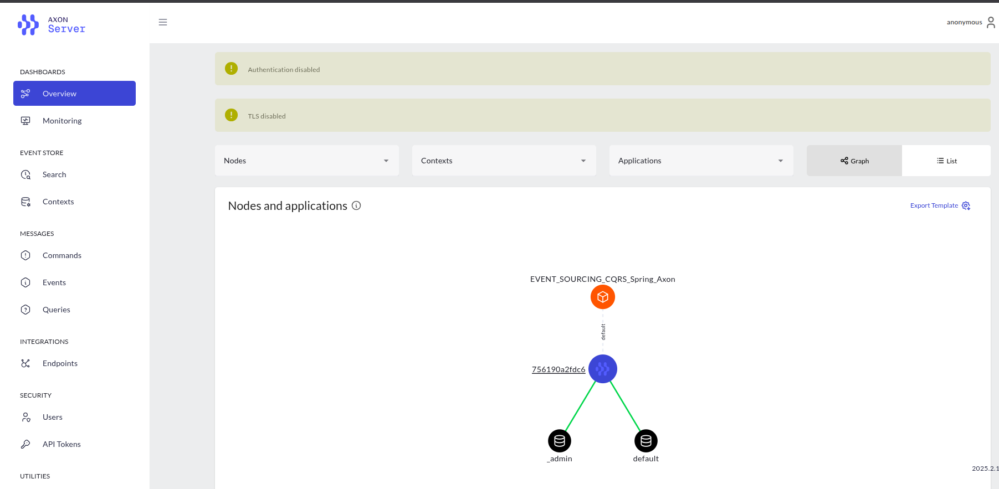

# Event Sourcing and Command Query Responsibility Segregation with Spring Boot and Axon Framework

## Abstract

This project presents a comprehensive implementation of Event Sourcing (ES) and Command Query Responsibility Segregation (CQRS) architectural patterns using the Spring Boot framework and the Axon Framework. The application models a banking system that manages financial accounts through an event-driven architecture, demonstrating the practical application of domain-driven design principles and reactive programming patterns. The system provides a scalable, maintainable foundation for managing complex business operations through immutable event logs and separated read/write models.

## Table of Contents
- [1. Introduction](#1-introduction)
- [2. Architectural Overview](#2-architectural-overview)
  - [2.1 Event Sourcing Pattern](#21-event-sourcing-pattern)
  - [2.2 CQRS Pattern](#22-cqrs-pattern)
  - [2.3 Integration with Axon Framework](#23-integration-with-axon-framework)
- [3. Technical Stack](#3-technical-stack)
  - [3.1 Core Technologies](#31-core-technologies)
  - [3.2 Infrastructure Components](#32-infrastructure-components)
  - [3.3 Development Environment](#33-development-environment)
- [4. System Architecture](#4-system-architecture)
  - [4.1 Architecture Diagram](#41-architecture-diagram)
  - [4.2 Data Flow Architecture](#42-data-flow-architecture)
- [5. Core Components](#5-core-components)
  - [5.1 Aggregate: AccountAggregate](#51-aggregate-accountaggregate)
  - [5.2 Domain Events](#52-domain-events)
  - [5.3 Command Handlers and Services](#53-command-handlers-and-services)
  - [5.4 Query Handlers and Services](#54-query-handlers-and-services)
  - [5.5 Persistence Layer](#55-persistence-layer)
  - [5.6 Data Transfer Objects](#56-data-transfer-objects)
  - [5.7 Domain Enumerations](#57-domain-enumerations)
- [6. API Specification](#6-api-specification)
- [7. Postgres Database](#7-postgres-database)
- [8. AXON Interface](#8-axon-interface)

## 1. Introduction

### 1.1 Problem Statement

Traditional CRUD-based applications present inherent limitations when managing complex business operations, particularly in financial systems where audit trails and historical state reconstruction are critical. Conventional approaches often struggle with:

- **Limited Auditability**: Lack of complete historical information about state changes
- **Scalability Issues**: Read and write operations on the same data model create bottlenecks
- **Temporal Inconsistency**: Difficulty in reconstructing historical states
- **Complexity in Reporting**: Read operations may require expensive queries and denormalization

### 1.2 Proposed Solution

This project addresses these limitations by implementing Event Sourcing combined with CQRS. Rather than storing only the current state, the system maintains an immutable event log representing all domain events. The event log serves as the single source of truth, enabling complete auditability and state reconstruction.

### 1.3 Objectives

- Implement a production-ready event-sourced banking system
- Demonstrate CQRS pattern separation of concerns
- Provide reactive query endpoints with real-time updates
- Establish best practices for Spring Boot integration with Axon Framework
- Create a scalable and maintainable codebase for domain-driven design

## 2. Architectural Overview

### 2.1 Event Sourcing Pattern

Event Sourcing is an architectural pattern where changes to the application state are captured as a sequence of immutable domain events. Rather than storing the current state directly, the system stores the complete event history, from which the current state can be derived.

**Benefits:**
- Complete audit trail of all state changes
- Ability to reconstruct system state at any point in time
- Foundation for implementing temporal queries
- Natural fit for handling eventual consistency in distributed systems

### 2.2 CQRS Pattern

Command Query Responsibility Segregation separates read and write operations into distinct models and services. The Command side handles business logic and state mutation, while the Query side provides optimized read access through denormalized views.

**Benefits:**
- Independent scaling of read and write operations
- Optimized data models for specific use cases
- Clearer separation of concerns
- Simplified testing and maintenance

### 2.3 Integration with Axon Framework

The Axon Framework provides comprehensive support for implementing CQRS and Event Sourcing:

- **Command Handling**: Annotation-driven command processing via `@CommandHandler`
- **Event Handling**: Subscription-based event processing via `@EventHandler`
- **Query Handling**: Annotation-driven query resolution via `@QueryHandler`
- **Aggregates**: Domain-driven aggregate root management with automatic event sourcing
- **Event Store**: Persistent event storage with replay capabilities
- **Projection**: Query model maintenance through event subscriptions
- **Snapshot Support**: Performance optimization through periodic state snapshots

## 3. Technical Stack

### 3.1 Core Technologies

| Component | Technology | Version |
|-----------|-----------|---------|
| Runtime Environment | Java Development Kit | 21 |
| Application Framework | Spring Boot | 3.5.7 |
| Event Sourcing & CQRS | Axon Framework | 4.12.2 |
| Event Store | PostgreSQL | 16.11 |
| Object Mapping | MapStruct | 1.6.3 |
| API Documentation | SpringDoc OpenAPI | 2.8.14 |
| Boilerplate Reduction | Lombok | Latest |
| Reactive Streams | Project Reactor | Latest |
| Build Tool | Apache Maven | Latest |

### 3.2 Infrastructure Components

- **PostgreSQL Database**: Primary persistence layer for event store and read models
- **Axon Server**: Event distribution and routing infrastructure
- **PgAdmin 4**: Database administration and monitoring interface

### 3.3 Development Environment

- **IDE Support**: JetBrains IntelliJ IDEA
- **Build System**: Maven 3.6+
- **Containerization**: Docker and Docker Compose

## 4. System Architecture

### 4.1 Architecture Diagram

### 4.2 Data Flow Architecture

**Command Execution Path:**
1. REST Client sends command request
2. Command Controller receives and validates input
3. Command Service submits command via CommandGateway
4. Axon Framework routes to appropriate @CommandHandler
5. Aggregate processes command and publishes domain events
6. Events are persisted in the Event Store
7. Response is returned asynchronously via CompletableFuture

**Query Execution Path:**
1. REST Client sends query request
2. Query Controller receives request
3. Query Service submits query via QueryGateway
4. Axon Framework routes to appropriate @QueryHandler
5. Handler queries denormalized read models from database
6. Results are returned to client
7. Optional: Subscription queries enable real-time updates

## 5. Core Components

### 5.1 Aggregate: AccountAggregate

The `AccountAggregate` class represents the core business entity and serves as the root aggregate in domain-driven design. It encapsulates the account domain logic and manages state transitions through event sourcing.

**Key Responsibilities:**
- Process account creation commands
- Validate and execute debit/credit operations
- Apply domain events to maintain aggregate state
- Enforce business rules (e.g., insufficient balance checks)
- Automatically trigger automatic account activation

**State Attributes:**
- `accountId`: Unique account identifier
- `balance`: Current account balance (BigDecimal)
- `currency`: Currency denomination
- `status`: Account lifecycle status (CREATED, ACTIVATED)

**Command Handlers:**
- `CreateAccountCommand`: Creates new account with initial balance
- `DebitAccountCommand`: Decreases account balance
- `CreditAccountCommand`: Increases account balance

**Event Sourcing Handlers:**
- `on(AccountCreatedEvent)`: Initializes aggregate state and triggers activation
- `on(AccountActivatedEvent)`: Transitions account to active status
- `on(AccountDebitedEvent)`: Applies debit transaction to balance
- `on(AccountCreditedEvent)`: Applies credit transaction to balance
- `on(AccountHeldEvent)`: Manages account hold status

### 5.2 Domain Events

Domain events represent significant business occurrences and serve as the immutable record of state changes.

#### 5.2.1 AccountCreatedEvent
- **Trigger**: Account creation command
- **Payload**: Account ID, initial balance, currency, status
- **Subscribers**: AccountAggregate, AccountQueryService
- **Purpose**: Establishes new account in the system

#### 5.2.2 AccountActivatedEvent
- **Trigger**: Automatic event sourcing handler in aggregate
- **Payload**: Account ID, ACTIVATED status
- **Subscribers**: AccountAggregate, AccountQueryService
- **Purpose**: Transitions account to operational status

#### 5.2.3 AccountDebitedEvent
- **Trigger**: Debit command validation
- **Payload**: Account ID, debit amount, currency
- **Subscribers**: AccountAggregate, AccountQueryService
- **Purpose**: Records account balance reduction with audit trail
- **Validation**: Ensures sufficient balance before applying

#### 5.2.4 AccountCreditedEvent
- **Trigger**: Credit command validation
- **Payload**: Account ID, credit amount, currency
- **Subscribers**: AccountAggregate, AccountQueryService
- **Purpose**: Records account balance increase with audit trail

#### 5.2.5 AccountHeldEvent
- **Trigger**: System or administrative action
- **Payload**: Account ID, HELD status
- **Subscribers**: AccountAggregate, AccountQueryService
- **Purpose**: Temporarily freezes account operations

### 5.3 Command Handlers and Services

#### 5.3.1 AccountCommandRestController
REST endpoint interface for command submission:

- `POST /commands/accounts/create`: Create new account
- `PUT /commands/accounts/debit`: Debit operation
- `PUT /commands/accounts/credit`: Credit operation

#### 5.3.2 AccountCommandServiceImpl
Business logic layer implementing command operations:
- Converts REST DTOs to domain commands
- Submits commands via Axon CommandGateway
- Returns CompletableFuture for asynchronous execution
- Generates unique account IDs via UUID

### 5.4 Query Handlers and Services

#### 5.4.1 AccountQueryRestController
REST endpoint interface for query operations:
- `GET /query/accounts/{id}`: Retrieve account by ID
- `GET /query/accounts`: List all accounts
- `GET /query/accountOperations/{accountId}`: Account transaction history
- `GET /query/{accountId}/watch`: Server-sent event stream for real-time updates

#### 5.4.2 AccountQueryService
Query handler implementation with event subscriptions:
- `on(AccountCreatedEvent)`: Persists new account in read model
- `on(AccountActivatedEvent)`: Updates account status
- `on(AccountDebitedEvent)`: Updates balance, records operation
- `on(AccountCreditedEvent)`: Updates balance, records operation
- Implements @QueryHandler methods for synchronous queries
- Emits subscription query updates for real-time consumers

#### 5.4.3 EventSourcingServiceImpl
Direct event stream access:
- Provides DomainEventStream via EventStore
- Enables event replay and audit trail retrieval
- Facilitates temporal queries and state reconstruction

### 5.5 Persistence Layer

#### 5.5.1 Entities

**BankAccount Entity:**
- `id`: Primary key (account UUID)
- `balance`: Current balance (BigDecimal precision)
- `status`: Account status (CREATED, ACTIVATED)
- One-to-many relationship with AccountOperation

**AccountOperation Entity:**
- `id`: Auto-incremented primary key
- `operationDate`: Transaction timestamp
- `amount`: Transaction amount
- `type`: Operation type (DEBIT, CREDIT)
- `bankAccount`: Foreign key relationship

#### 5.5.2 Repositories

- `BankAccountRepository`: JPA repository for account queries
- `AccountOperationRepository`: JPA repository for transaction history

### 5.6 Data Transfer Objects

#### Command DTOs
- `CreateAccountRequestDTO`: Initial account creation parameters
- `DebitAccountRequestDTO`: Debit transaction details
- `CreditAccountRequestDTO`: Credit transaction details

#### Query DTOs
- `GetAccountQueryDTO`: Single account query parameters
- `GetAllAccountsRequestDTO`: List accounts query
- `GetAccountOperationsQueryDTO`: Transaction history query
- `BankAccountResponseDTO`: Account response representation
- `AccountOperationResponseDTO`: Operation response representation

### 5.7 Domain Enumerations

#### AccountStatus
- `CREATED`: Initial account status
- `ACTIVATED`: Operational status

#### OperationType
- `DEBIT`: Balance-reducing transaction
- `CREDIT`: Balance-increasing transaction

## 6. API Specification

### 6.1 Command API (Write Model)

#### 6.1.1 Create Account

#### 6.1.2 Debit Account

#### 6.1.3 Credit Account

## 7. Postgres Database

## 8. AXON Interface

